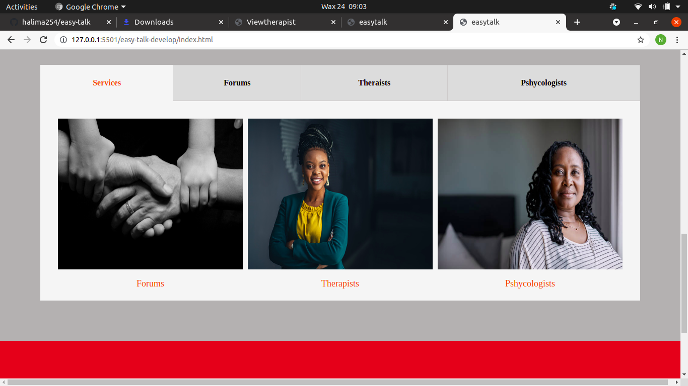
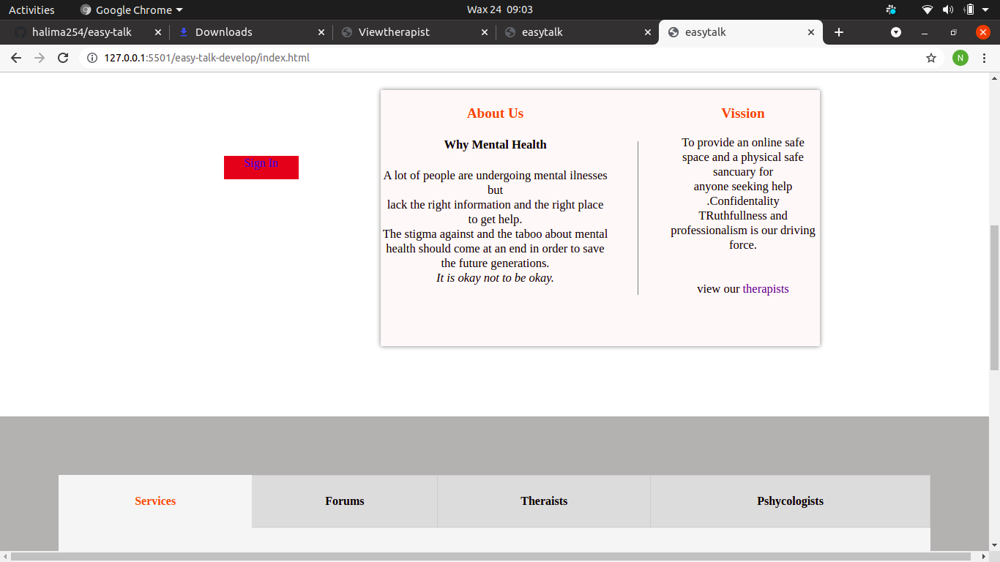
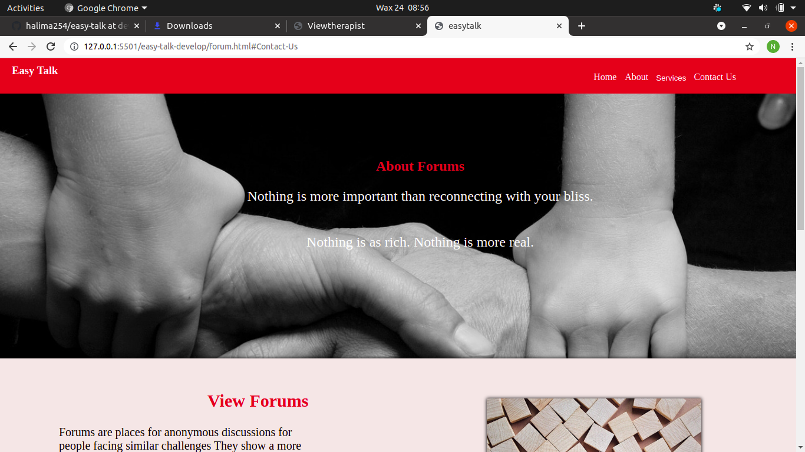
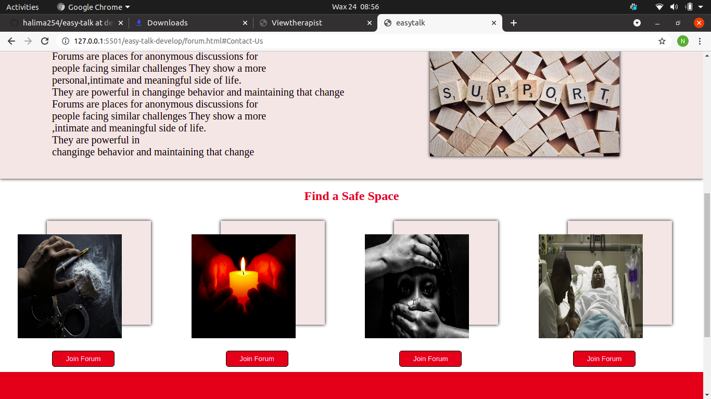
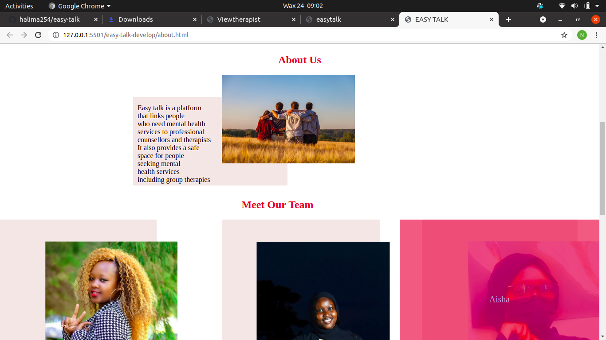

# EASY TALK
# THIS PROJECT WAS DEVELOPED BY:
* HALIMA CHEPTOO
* NANCY KIGOTHO
* AISHA AHMED
* ENOCK KIPRONOH
* KYLE KIBET
# DESCRIPTION
### Easy talk is a platform that links people who need mental health services to professional counsellors and therapists.Due to the increase in the rate of suicides and people taking each others lives we felt that it would really help to have a platform where people can come and share their burden and find someone to guide and listen to them.We should take care of our mental health the same way we take care of our body.
# TECHNOLOGIES USED
* HTML
* CSS
* JAVASCRIPT
# iNSTRUCTIONS ;
* While on the home page and you want to see other pages e.g the about page,click on the links on the navigation bars and they will direct you to that page.
* if a person wants to view therapist or join a forum he/she has to sign up or sign in if he/she already has an account.
* if a counsellor or a therapist wants to register with us he/she must sign up too under counsellors checkbox.
* The contact us link will direct you to our footer.
There you will find our social media handles,location and email addresses.
# REQUIREMENTS
* Web browser.
* Git.
* Git Hub.
# CONTACT INFORMATION
* If you have any questions,comments or even impressed enough with our work to give us a job opportunity you can reach us via;
 easytalk009@gmail.com or call us 0722985089.
# GITHUB LINK
https://github.com/halima254/easy-talk/tree/develop
# IMAGES

# LICENSING.
Copyright <YEAR> <COPYRIGHT HOLDER>

Permission is hereby granted, free of charge, to any person obtaining a copy of this software and associated documentation files (the "Software"), to deal in the Software without restriction, including without limitation the rights to use, copy, modify, merge, publish, distribute, sublicense, and/or sell copies of the Software, and to permit persons to whom the Software is furnished to do so, subject to the following conditions:

The above copyright notice and this permission notice shall be included in all copies or substantial portions of the Software.

THE SOFTWARE IS PROVIDED "AS IS", WITHOUT WARRANTY OF ANY KIND, EXPRESS OR IMPLIED, INCLUDING BUT NOT LIMITED TO THE WARRANTIES OF MERCHANTABILITY, FITNESS FOR A PARTICULAR PURPOSE AND NONINFRINGEMENT. IN NO EVENT SHALL THE AUTHORS OR COPYRIGHT HOLDERS BE LIABLE FOR ANY CLAIM, DAMAGES OR OTHER LIABILITY, WHETHER IN AN ACTION OF CONTRACT, TORT OR OTHERWISE, ARISING FROM, OUT OF OR IN CONNECTION WITH THE SOFTWARE OR THE USE OR OTHER DEALINGS IN THE SOFTWARE.

